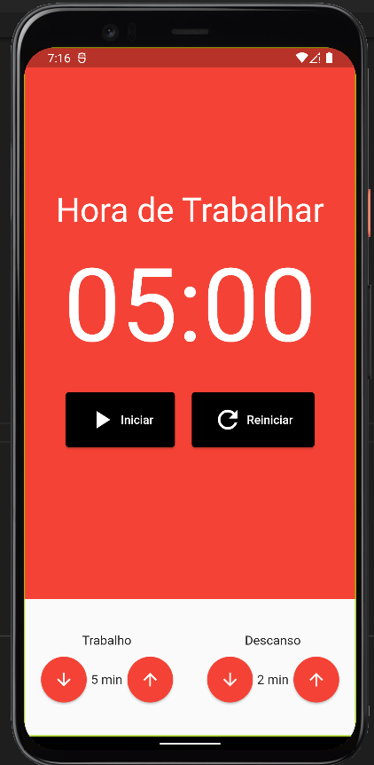
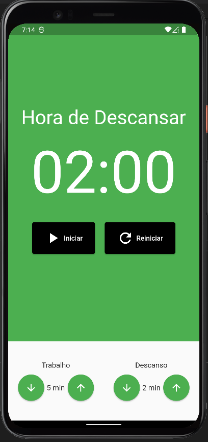

# Pomodoro Tracker with Flutter and MobX

A Tasks project made with Flutter and usage a Hive local database.

A Pomodoro Tracker project made with Flutter and use MobX


## Work screen





## Rest screen



## Packages usage

#Dependencies

* mobx: ^2.0.7+5
* flutter_mobx: ^2.0.6+1
* provider: ^6.0.3

#Dev Dependencies 

* build_runner: ^2.2.0
* mobx_codegen: ^2.0.7

Add this packages in your Flutter file pubspec.yaml and run 

```
flutter pub get
```
